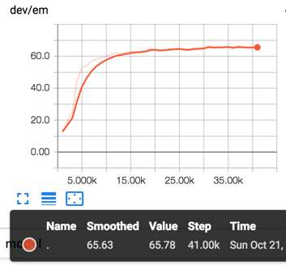
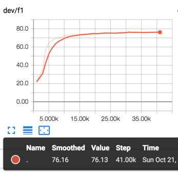
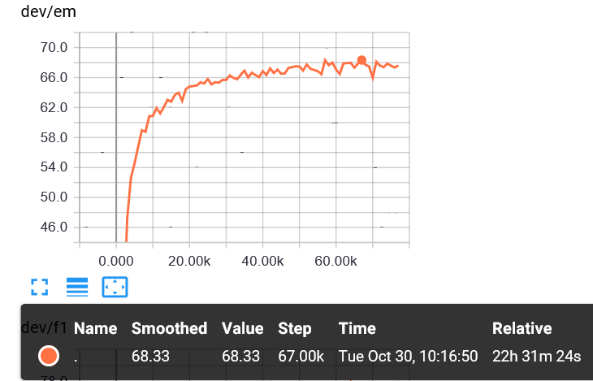
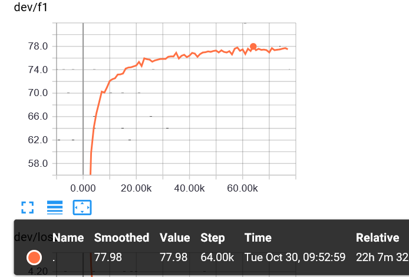

# QAnetEstimator
 a implementation of google QAnet,  a tensorflow estimator version,  have very good proved performance
 
##overview
 A Tensorflow implementation of Google's [QANet](https://openreview.net/pdf?id=B14TlG-RW).
 thanks [nlplearn](https://github.com/NLPLearn/QANet) a lot, some implementation details came from their work.
 but overall, this is a whole new version using estimator-api, dataset-api and layers-api. these can make code more concise and clear
 and I've done extra processing on padding to ensure that the padding data doesn't pollute the normal input data in the neural network. I've got higher F1 and EM under the same suite parameter than  [nlplearn](https://github.com/NLPLearn/QANet)'s version
 
## Requirements
  * Python>=3.5
  * TensorFlow>=1.10
   
## Usage
    I use a parameter to switch models (there is a bidaf flow model inside) 
    --procedure "wordembedding","QAnetEmbedding","dcn","QaModelBlock","QAOutput" 
    using this procedure, a qanet is built.
     
## todo
   add elmo to replace embedding layer
   
## Result
The dataset used for this task is [Stanford Question Answering Dataset](https://rajpurkar.github.io/SQuAD-explorer/)
I did not use it directly, but copy my network to nlplearn's qanet, you can see this on [my fork version](https://github.com/linsu07/QANet)
and get result below

    nlplearn's em 
   
    
    nlplearn's f1
   
   
    my version's em
   
   
    my version's f1
   
   